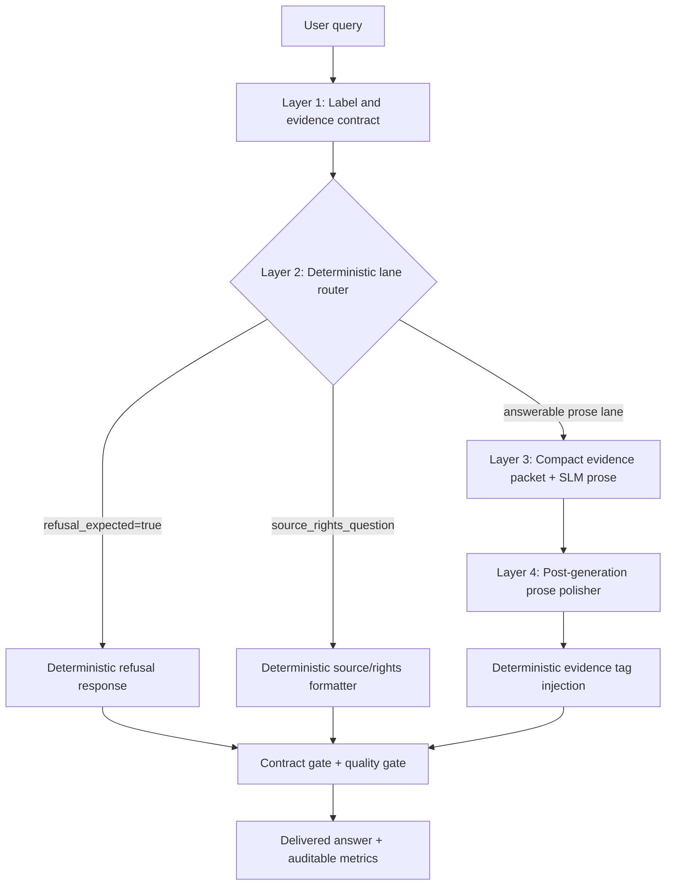

# System Design: Four-Layer Decoupled Browser-Side RAG

## Claim

The final Round 03 system is not a prompt-only RAG pipeline. It is a four-layer reliability and latency architecture that deliberately separates deterministic archive-policy work from small-model prose generation. The central design choice is that the browser-side SLM should not be responsible for tasks that can be performed exactly by the surrounding system.

## Architecture

## Layer 1: Label And Evidence Contract

The first layer is a deterministic contract over labels and gold evidence. Each query is associated with an intent, allowed lane, sufficiency/refusal state, gold evidence IDs, required fields, and must-not-invent fields. The contract prevents a generated answer from being treated as valid unless its required evidence fields can be verified against the selected records.

Failure mode if removed: the system cannot distinguish between an answer that sounds plausible and an answer that is grounded in the archive contract. In earlier rounds this appeared as field visibility warnings, source/right mismatches, and refusal failures.

## Layer 2: Deterministic Lane Router

Two classes of query are removed from free-form model generation:

- Refusal-required rows produce the fixed refusal sentence.
- Source/rights rows format `RIGHTS`, `REUSE`, `PUBLIC_DOMAIN`, and `SOURCE` directly from evidence.

This layer is a system capability rather than a model capability. It is reported separately as hybrid deterministic latency and is not mixed into claims about Qwen generation skill.

Failure mode if removed: the model may answer when evidence is insufficient, interpret rights fields instead of copying them, omit source tags, or truncate long source values. The failure-mode report records Round 01 refusal failures and Round 01/02 source-rights field failures as evidence for this layer.

## Layer 3: Compact Evidence Packets For Prose Generation

For the remaining answerable rows, the model receives a compact value-oriented evidence summary rather than raw records. The packet preserves the information needed for prose while removing long non-contract fields. This reduces prompt size and TTFT without weakening the contract, because the official evidence tags are injected later from the records themselves.

Failure mode if removed: larger prompts inflate TTFT and long-tail latency. Earlier less-pruned variants had higher Qwen average latency and P95 latency.

## Layer 4: Post-Generation Prose Polisher And Tag Injection

After the SLM writes prose, a deterministic postprocessor applies caution-oriented prose edits and injects exact evidence tags. The polisher handles overconfident language and unsupported first/earliest phrasing without asking the model to follow long negative instructions. Evidence tags are appended from records, not copied from model output.

Failure mode if removed: field visibility and overconfidence become model-dependent. V3.1 showed fast generation but residual overconfidence; V3.2 removed that risk with prompt-heavy guardrails at a large latency cost; V3.3 preserved caution through postprocessing while returning to low latency.

## Design Principle

The system deliberately assigns each task to the cheapest reliable component:

| Task | Responsible component | Reason |
|---|---|---|
| Evidence sufficiency and refusal decision | Label/evidence contract | Deterministic and auditable |
| Rights/source reporting | Rule formatter | Requires exact copying, not interpretation |
| Natural-language explanation | Browser-side SLM | Benefits from prose generation |
| Caution and field visibility | Postprocessor + tag injection | Faster and more reliable than prompt-only guardrails |

This decoupling is the main architectural contribution: reliability is not delegated entirely to the small language model, and latency is not sacrificed to make the model perform deterministic bookkeeping.

